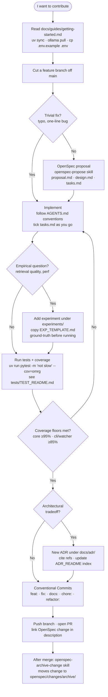

# Contributing to OMRG — Opinionated Modular RAG

Thanks for taking the time to contribute. This guide is the front door:
it shows the path from "I have an idea" to "my PR is open" and points
you at the deeper docs at each step, so you do not need to read the
whole repo to get started.

If you are an AI agent, also read [`AGENTS.md`](./AGENTS.md). Everything
in this guide applies to you too.

---

## Setup

Prerequisites, install commands, and the verification checklist live in
[`docs/guides/getting-started.md`](./docs/guides/getting-started.md).
Get that running first; nothing in this guide will work without it.

---

## The Contribution Loop

### Step by step

**Setup.** Install `uv` and `ollama`, pull the embedding model, copy
`.env.example` to `.env`, run `uv sync`. Full instructions in
[`docs/guides/getting-started.md`](./docs/guides/getting-started.md).
Verify with `uv run omrg` — silent stdout means it is working.

**Branch off main.** Use a descriptive name. Examples: `add-watcher-debounce`,
`fix-reranker-singleton-leak`, `docs-clarify-collection-isolation`. Never
commit directly to main.

**Trivial fix shortcut.** Typos, comment fixes, single-line bug fixes,
or anything that obviously does not change behaviour can skip OpenSpec
and go straight to implementation. If you are not sure whether your
change qualifies, it does not — write the proposal.

**OpenSpec proposal.** For anything non-trivial, run the
`openspec-propose` skill (or follow [`openspec/`](./openspec/) by hand).
A change lives in `openspec/changes/<change-id>/` and contains:

- `proposal.md` — Why, What Changes, Capabilities, Impact
- `design.md` — Goals, Decisions with rationale, Risks
- `tasks.md` — Checkbox list you tick off during implementation
- `specs/` — Spec deltas, when behaviour changes are spec-level

The archive under `openspec/changes/archive/` has twelve worked
examples. Mirror the closest one for shape.

**Implement.** Work through `tasks.md` and tick boxes as you go. Follow
the conventions in [`AGENTS.md`](./AGENTS.md) — coding style, package
manager (`uv`/`bun`), commit style, hard boundaries (no PyTorch at
runtime, no API keys, ChromaDB is local-only). Match the project's
existing patterns; do not introduce new dependencies without flagging
it in the proposal first.

**Experiment when an empirical question is in the loop.** If your
change rests on a claim about retrieval quality, embedding speed, or
any other measurable behaviour, the answer goes in `experiments/`.
Copy [`experiments/EXP_TEMPLATE.md`](./experiments/EXP_TEMPLATE.md)
into a new directory named `<descriptive-slug>-<YYYY-MM-DD>/` and fill
it in. Write the ground-truth queries before running anything — this
is the rule that prevents confirmation bias. Use
`CHROMA_PERSIST_DIR=./chroma_db_test` so you never touch production
data. Full conventions in [`experiments/EXP_README.md`](./experiments/EXP_README.md).

**Tests.** See [`tests/TEST_README.md`](./tests/TEST_README.md) for
quick-start commands, gotchas, and how to add a new test. The fast
suite (no Ollama, no disk I/O) must pass before you push, and coverage
must stay above the per-module floors.

**ADR if architectural.** ADRs record significant architectural
decisions — package manager choice, vector store choice, async vs sync
ingest, that level. Bug fixes, refactors, and feature additions
generally do not need one. If your change locks the project into a
direction (a new core dependency, a new transport, a new data model),
write an ADR. Convention is in
[`docs/adr/ADR_README.md`](./docs/adr/ADR_README.md). Number
sequentially, set status to `Proposed`, cite both internal docs (other
ADRs, OpenSpec changes, experiments) and external references (RFCs,
papers, blog posts) where they informed the decision. Update the index
table in `ADR_README.md`.

**Commit.** Conventional Commits. One commit per logical change is
ideal but not enforced. The prefix matters because
[`python-semantic-release`](./AGENTS.md) reads it on push to `main`:

| Prefix                                             | Version bump | Use for                            |
| -------------------------------------------------- | ------------ | ---------------------------------- |
| `feat:`                                            | minor        | new user-visible capability        |
| `fix:` / `perf:`                                   | patch        | bug fix or performance improvement |
| `feat!:` or `BREAKING CHANGE:` footer              | major        | incompatible change                |
| `docs:` / `chore:` / `test:` / `refactor:` / `ci:` | none         | no release                         |

Never edit `version` in `pyproject.toml` by hand. PSR owns it.

**Push and open the PR.** Push the branch with `git push -u origin <branch>`.
The PR description should:

- Summarise what changed in two or three lines
- Link the OpenSpec change folder if there is one
- List any new dependencies and explain why
- Note coverage impact if it moved
- Flag any user-visible behaviour change

**After merge — archive the OpenSpec change.** Run the
`openspec-archive-change` skill or move the folder by hand to
`openspec/changes/archive/<YYYY-MM-DD>-<change-id>/`. The user does
this manually; the build agent does not.

---

## Coding conventions

These live in [`AGENTS.md`](./AGENTS.md). The non-negotiables:

- **British English** in documentation, comments, commit messages, and
  user-facing text. American spelling is fine for code identifiers.
- **Type annotations on every function**. New modules start with
  `from __future__ import annotations`.
- **Google-style docstrings** on public functions and classes.
- **Files under ~500 lines.** Split by responsibility before they grow.
- **Avoid deep nesting** beyond three levels — guard clauses and early
  returns.
- **DRY but only after three uses** (Rule of Three).
- **No hardcoded paths or secrets.** Everything via `.env`.

Architectural rules specific to this codebase (single-source `config.py`,
no cross-imports between `ingestion.py` and `retrieval.py`, error-return
contract for MCP tools, `÷30` reranker threshold scaling) live in
[`AGENTS.md`](./AGENTS.md) under "Non-Obvious Rules". Read them before
touching the affected modules.

---

## PR checklist

Before marking a PR ready for review:

- [ ] Branch is up to date with `main`
- [ ] `uv run pytest -m "not slow" --cov=omrg` passes
- [ ] Coverage floors hold (core ≥95%, CLI/watcher ≥85%, overall ≥90%)
- [ ] If the change is architectural, an ADR exists and the index is updated
- [ ] If the change has an OpenSpec proposal, `tasks.md` boxes are all ticked
- [ ] If the change rests on an empirical claim, the experiment is in `experiments/`
- [ ] Commit message uses a Conventional Commits prefix
- [ ] No secrets, API keys, or production data in the diff
- [ ] User-visible changes are reflected in `README.md` or the relevant guide

---

## Where to find things

| You are looking for                        | It lives in                                                                                                                |
| ------------------------------------------ | -------------------------------------------------------------------------------------------------------------------------- |
| Setup and prerequisites                    | [`docs/guides/getting-started.md`](./docs/guides/getting-started.md)                                                       |
| Conventions, MCP rules, hard boundaries    | [`AGENTS.md`](./AGENTS.md)                                                                                                 |
| Architectural decisions                    | [`docs/adr/`](./docs/adr/) and [`docs/adr/ADR_README.md`](./docs/adr/ADR_README.md)                                        |
| OpenSpec proposals (active and archived)   | [`openspec/changes/`](./openspec/changes/)                                                                                 |
| Active specs                               | [`openspec/specs/`](./openspec/specs/)                                                                                     |
| Experiment template and conventions        | [`experiments/EXP_TEMPLATE.md`](./experiments/EXP_TEMPLATE.md), [`experiments/EXP_README.md`](./experiments/EXP_README.md) |
| Test suite quick-start and gotchas         | [`tests/TEST_README.md`](./tests/TEST_README.md)                                                                           |
| Wider testing strategy and coverage policy | [`docs/guides/testing.md`](./docs/guides/testing.md)                                                                       |
| Configuration variables                    | [`.env.example`](./.env.example) and `config.py`                                                                           |
| CLI reference                              | [`docs/guides/cli-reference.md`](./docs/guides/cli-reference.md)                                                           |
| MCP tool reference                         | [`docs/guides/mcp-tools.md`](./docs/guides/mcp-tools.md)                                                                   |
| Architecture overview                      | [`docs/guides/architecture.md`](./docs/guides/architecture.md)                                                             |

---

## Licence

By contributing, you agree that your contributions are licensed under
the [MIT Licence](./LICENSE).
